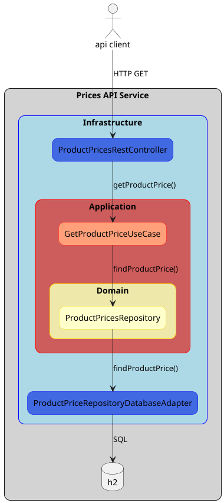
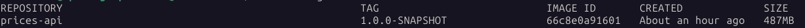

# inditex Prices API

## Overview
This application simulates a service that publishes a synchronous API to retrieve the price that is applied to a 
product in a determinate date. It only has one GET API call that allows filtering by:
* brand ID
* product ID
* date

The result of the API will be a 404 - Not Found error if there is no price for the input or an object with the 
price information for that brand, product and date.

The service contains an in-memory database (H2) with the product prices information.

The application is based on Spring boot + Java, compiled & packaged with maven wrapper.

There is a local environment provided in the project directory, located at `local-env` directory. There is also a
postman collection and a postman environment to interact with the `local-env` in the `postman` directory.


### Technologies
The application is created using the following technologies:
  * Java 17
  * Maven 3.9.9
  * SpringBoot 3.4.6
  * Docker 28.2.2

It also uses the following java libraries:
  * H2 in-memory database (2.3.232)
  * Flyway 11.9.0
  * ModelMapper 3.2.3
  * Lombok 1.18.38


### Architecture
The application is composed of two basic elements:
  * The service publishing the Prices API
  * The in-memory database containing the product prices information

The in-memory database is actually a component of the service itself, but in the future it could be split from the
service to a persistent database, so it's useful to consider it as a separated component.

The service is implemented using hexagonal architecture, with these layers:
  * Domain: this layer would include the business entities (`ProductPrice`) and the repository interfaces to access them.
  * Application: this layer would include all the UseCases with the business logic (`GetProductPriceUseCase`)
  * Infrastructure: this layer would include all port interfaces and adapter implementations for inbound and outbound
  communications from the application/domain layers:
    - Ports: In this case we don't have any port because the only outbound communication from the UseCases is to the
    `ProductPriceRepository`, and, as this Repository recovers the domain entities, it is considered to be inside
    the domain. Regarding the inbound communications, as they are Rest Controllers and won't be called from the
    application layer, they don't need an interface.
    - Adapters: In this case we have Rest Controller adapters (`ProductPricesRestController`) as entry points of the
    service (inbound) and we have an outbound adapter for the `ProductPriceRepository` to implement the Repository
    features against the H2 database (`ProductPriceRepositoryDatabaseAdapter`)



The workflow of the application would be:
1. The entry point of the Prices API Service is the API published in the `ProductPriceRestController`, which is an adapter
in the infrastructure layer.
2. When this controller receives a GET request, it map the received REST model to the corresponding UseCase model
and it will send a request to that UseCase in the application layer (`GetProductPriceUseCase` in this case)
3. The UseCase will run the corresponding business logic, communicating with the domain layer to retrieve the necessary
entities (in this case `ProductPrice` entities from `ProductPriceRepository`) and do the required actions using the 
services in the domain layer (in this case we don't have any action, we just recover entities from the
`ProductPriceRepository`)
4. The domain's `ProductPriceRepository` is implemented as a Database Adapter in the infrastructure layer and will go
to the in-memory h2 database to run the required SQL query, convert the JPA entity to domain entity and return it to the
caller Use Case.
5. The caller Use Case will prepare the response converting the domain entity model to the Use Case response model.
6. The Controller will prepare the HTTP response converting the Use Case response model to the REST response model.


## Compile, Package & Deploy
The application is compiled and packaged using the maven wrapper located in the project root diretory. You will need
to have installed a JDK with version 17+ to compile and package it.

You can do it with: 
```
./mvnw clean package
```

This should compile, run the tests and create the Springboot runnable jar under `target` with the name `prices-api.jar` 

The maven `install` phase also create a docker image with the Springboot runnable jar. You will need to have docker
installed to run it (untested outside of Linux environments):
```
./mvnw clean install
```

Besides the runnable jar under the `target` directory, this command should generate a docker image with the service:


## Running the service
To run the standalone service (without docker image, just the jar), follow the compile & package procedure explained
above and, from the project's root folder, run:
```
java -jar -Dspring.config.location=local-env/prices-api/application.yml target/prices-api.jar
```

In this case, we are using the same configuration file that is prepared for the local-environment. Feel free to 
create your own configuration, you can use it as a template.

If you want to run the service from IntelliJ or another IDE, just take into account that the service doesn't have an
application.yml or configuration file by itself. You need to change the Run Configuration to specify where is the
desired application.yml or copy the `local-env/prices-api/application.yml` to the project's root folder. 

## Local environment
The local environment is based on docker, and uses a `docker-compose.yaml` as the descriptor, even it only starts one
service with the Spring microservice. 

You will need to have `docker` and `docker compose` plugin installed. This was
created and tested with docker version `28.2.2` and docker compose version `2.36.2`


## Starting local environment
To start the development environment, run the following steps:

1 - Compile microservice and build docker image. From the root directory of the project run:
```
./mvnw clean install
```

2 - Start the development environment, go to `local-env` directory and run:
```
docker compose up
```

Now you should be able to launch API calls. You can also try `http://localhost:8080/swagger-ui/index.html` from a
browser to see the API definition.


## Testing in local environment with postman
If the local environment is up & running you can open the postman collection and postman environment located at 
`postman` directory and send the saved requests there.