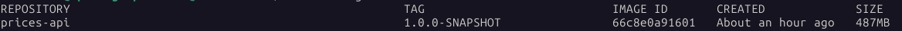

# inditex Prices API

### Overview
This application simulates a service that publishes an API to retrieve the price that is applied to a product in 
a determinate date. It only has one GET API call that allows filtering by:
* brand ID
* product ID
* date

The result of the API will be a 404 - Not Found error if there is no price for the input or an object with the 
price information for that brand, product and date.

The service contains an in-memory database (H2) with the product prices information.

The application is based on Spring boot + Java, compiled & packaged with maven wrapper.

There is a local environment provided in the project directory, located at `local-env` directory. There is also a
postman collection and a postman environment to interact with the `local-env` in the `postman` directory.

## Compile, Package & Deploy
The application is compiled and packaged using the maven wrapper located in the project root diretory. You will need
to have installed a JDK with version 17+ to compile and package it.

You can do it with: 
```
./mvnw clean package
```

This should compile, run the tests and create the Springboot runnable jar under `target` with the name `prices-api.jar` 

The maven `install` phase also create a docker image with the Springboot runnable jar. You will need to have docker
installed to run it (untested outside of Linux environments):
```
./mvnw clean install
```

Besides the runnable jar under the `target` directory, this command should generate a docker image with the service:


## Running the service
To run the standalone service (without docker image, just the jar), follow the compile & package procedure explained
above and, from the project's root folder, run:
```
java -jar -Dspring.config.location=local-env/prices-api/application.yml target/prices-api.jar
```

In this case, we are using the same configuration file that is prepared for the local-environment. Feel free to 
create your own configuration, you can use it as a template.

## Local environment
The local environment is based on docker, and uses a `docker-compose.yaml` as the descriptor, even it only starts one
service with the Spring microservice. 

You will need to have `docker` and `docker compose` plugin installed. This was
created and tested with docker version `28.2.2` and docker compose version `2.36.2`


## Starting local environment
To start the development environment, run the following steps:

1 - Compile microservice and build docker image. From the root directory of the project run:
```
./mvnw clean install
```

2 - Start the development environment, go to `local-env` directory and run:
```
docker compose up
```

Now you should be able to launch API calls. You can also try `http://localhost:8080/swagger-ui/index.html` from a
browser to see the API definition.


## Testing in local environment with postman
If the local environment is up & running you can open the postman collection and postman environment located at 
`postman` directory and send the saved requests there.